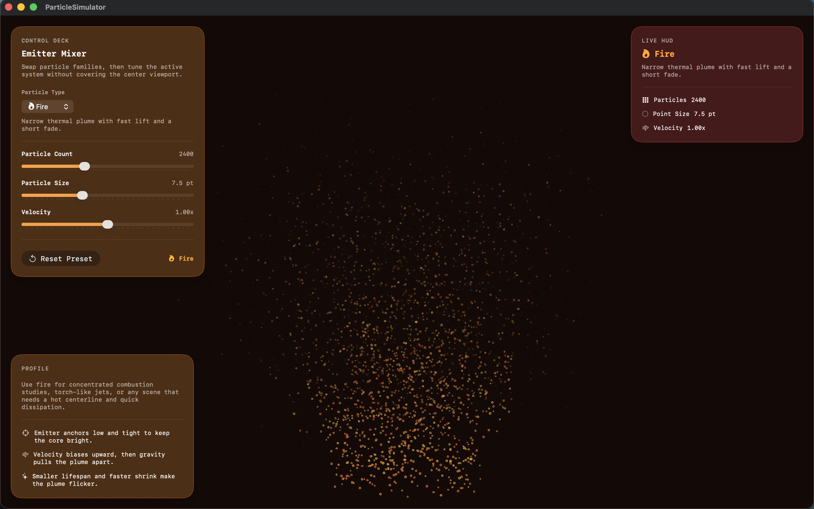
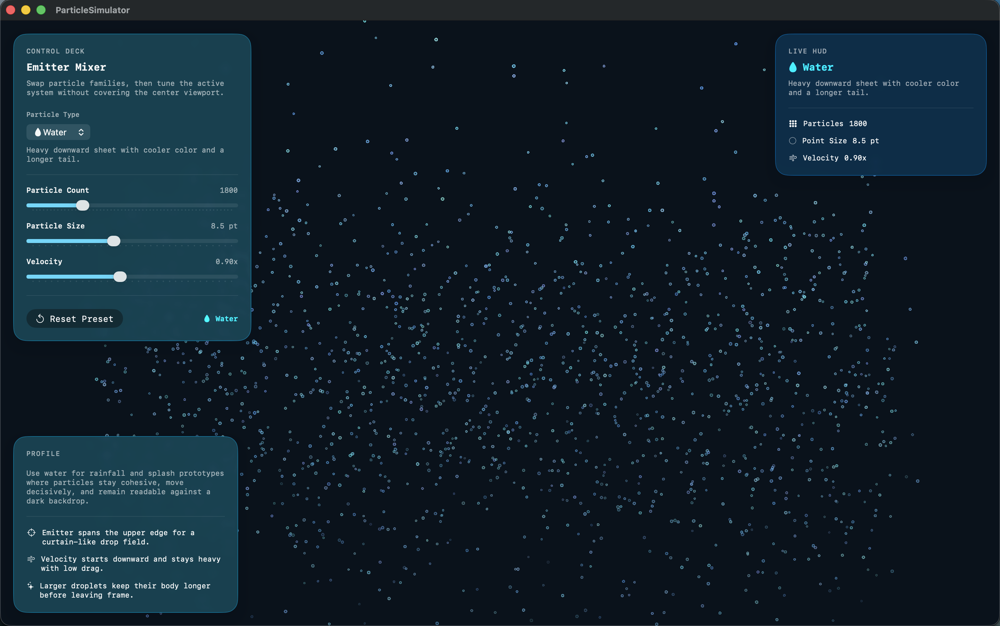
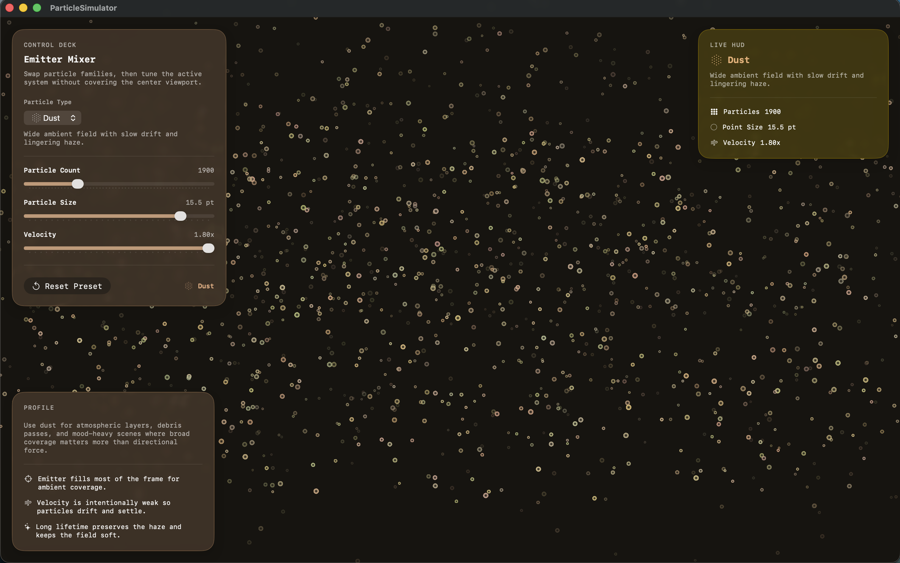

# GPU Particle System in Apple Metal for macOS

**Final Project Report**  
**Course:** CS 4361.001 Computer Graphics  
**Student:** Nicholas Watts  
**Original Submission Date:** May 3, 2026<br>
**Last Updated:** May 12, 2026

## Team Member and Project Title

This was an individual project completed by Nicholas Watts.

The project title is **GPU Particle System in Apple Metal for macOS**.

## Problem Summary

Particle systems are a common technique in computer graphics for representing effects that are difficult to model with rigid geometry, such as fire, smoke, sparks, dust, snow, water, and other natural phenomena. Instead of modeling one solid object, a particle system represents the effect as many small particles that each have properties such as position, velocity, color, size, and lifetime. When many particles are simulated and rendered together, they can create visually convincing effects.

The original project proposal focused on building a real-time particle system for macOS using Apple Metal. The main problem was to create visually appealing particle-based effects while maintaining interactive performance as the number of particles increases. Traditional CPU-based particle systems can become expensive when particle counts grow, so the project explores GPU-based simulation and rendering using Metal.

This problem is important because particle systems are widely used in games, simulations, visual effects, and interactive graphics applications. The project also connects directly to core computer graphics topics: rendering pipelines, buffers, shaders, alpha blending, animation, simulation updates, compute passes, and performance tradeoffs.

## Description of Work

The final implementation is a macOS particle simulator built with SwiftUI, MetalKit, and Metal shaders. The application displays a full-window particle viewport rendered with Metal and overlays a modern SwiftUI control interface for selecting and tuning particle effects.

The Metal portion of the project uses an `MTKView`, an `MTLRenderPipelineState`, an `MTLComputePipelineState`, a shared particle buffer, and custom Metal shader functions. Each particle is rendered as a soft circular point sprite. The fragment shader discards pixels outside the circular point shape and uses smooth alpha falloff so the particles blend more naturally. Alpha blending is enabled in the render pipeline so overlapping particles can build up visible density.

The simulation state is represented with a `Particle` structure containing position, velocity, color, size, life, and maximum life. Particle simulation now runs on the GPU through a Metal compute shader. Each frame, the renderer encodes a compute pass that updates particle position, velocity, lifetime, alpha fade, size decay, out-of-bounds checks, and respawn behavior directly in the particle buffer. The render pass then draws the same updated buffer. The CPU still initializes or rebuilds particle data when presets and initialization parameters change, but the per-frame simulation loop is GPU-driven.

The project also became more modular than the original fixed particle demo. The final version defines a `ParticleMaterial` preset system with six particle types:

- **Fire:** A narrow rising plume with warm colors, upward motion, and quick fading.
- **Water:** A cooler falling sheet with heavier downward motion and larger droplet particles.
- **Dust:** A wide drifting field with slower motion, softer colors, and longer particle lifetimes.
- **Smoke:** A soft rising plume with larger translucent particles and slow diffusion.
- **Sparks:** Small bright flecks with fast launch speed, strong gravity, and quick decay.
- **Snow:** A wide top-edge weather field with gentle falling motion and wind-readable drift.

The SwiftUI interface includes a corner-focused Liquid Glass style overlay. The control panels stay near the edges of the window so the center of the particle viewport remains visible. The UI includes:

- A particle type picker for Fire, Water, Dust, Smoke, Sparks, and Snow.
- A particle count slider.
- A particle size slider.
- A velocity slider.
- Gravity and wind controls for live environmental force tuning.
- A reset button for returning to preset defaults.
- A live HUD showing the selected preset and current parameter values.
- A performance HUD showing FPS, frame time, CPU frame time, CPU simulation/encoding time, and particle count.
- A profile panel describing the selected effect's emission, motion, and fade behavior.

The main challenge was balancing the rendering work, simulation logic, and user-facing controls. Metal rendering required matching the Swift particle memory layout with the Metal shader structure, setting up both render and compute pipelines correctly, and handling alpha blending. The SwiftUI/Metal bridge also required keeping the `MTKView` alive while still allowing SwiftUI controls to update the active particle configuration. Another challenge was making the interface useful without covering the simulation view, which led to a corner-based overlay design.

## Results

The final result is an interactive macOS particle simulator that renders and simulates thousands of particles in real time using Metal. The project achieved a working Metal render pipeline, a GPU compute simulation pass, live particle animation, multiple effect presets, adjustable runtime parameters, and a performance measurement overlay.

The concrete results are:

- A macOS SwiftUI application with an embedded `MTKView`.
- A Metal render pipeline using custom vertex and fragment shaders.
- A Metal compute pipeline for per-frame particle simulation.
- Point-sprite particle rendering with circular alpha falloff.
- Alpha blending for softer overlapping particles.
- Runtime particle state with position, velocity, color, size, life, and maximum life.
- GPU-side particle motion, lifetime decay, fading, size decay, bounds checks, and respawn.
- Six selectable particle presets: Fire, Water, Dust, Smoke, Sparks, and Snow.
- Interactive controls for particle count, particle size, velocity, gravity, and wind.
- A performance HUD for comparing CPU overhead before and after simulation changes.
- A modern corner-based UI overlay that keeps the main viewport mostly unobstructed.
- A reset action for restoring each preset's default settings.

The current default preset values are:

| Preset | Default Count | Default Size | Default Velocity | Default Gravity | Default Wind | Visual Behavior |
| --- | ---: | ---: | ---: | ---: | ---: | --- |
| Fire | 2400 | 7.5 | 1.00x | 1.00x | +0.00 | Rising warm plume |
| Water | 1800 | 8.5 | 0.90x | 1.15x | +0.00 | Falling cool sheet |
| Dust | 3200 | 5.5 | 0.35x | 0.45x | +0.15 | Slow drifting haze |
| Smoke | 3600 | 10.0 | 0.45x | 0.25x | +0.12 | Soft rising plume |
| Sparks | 1400 | 3.2 | 1.45x | 1.70x | +0.00 | Fast bright flecks |
| Snow | 4200 | 4.2 | 0.42x | 0.70x | +0.05 | Gentle falling field |

The adjustable ranges are:

| Parameter | Range |
| --- | --- |
| Particle Count | 400 to 6000 |
| Particle Size | 2.0 to 18.0 |
| Velocity Scale | 0.20x to 1.80x |
| Gravity Scale | 0.00x to 2.00x |
| Wind Strength | -1.20 to +1.20 |

### Screenshots and Video

**Figure 1:** Fire preset with the Liquid Glass control deck visible in the upper-left corner.



**Figure 2:** Water preset showing falling blue particles and the live HUD.



**Figure 3:** Dust preset showing the wider, slower ambient particle field.



**Demo Video:**
https://youtu.be/dnsiDCSfgtY

## Analysis of Work

The project now meets the major goals from the original proposal.

The strongest completed goals are the macOS application, the Metal rendering pipeline, GPU-based particle updates, real-time particle rendering, runtime particle properties, a modular visual effect system, multiple presets, environmental force controls, and interactive parameter controls. The application demonstrates core graphics concepts such as buffers, shaders, blending, animation, render loops, compute kernels, and CPU/GPU workload separation.

The most important technical improvement is the move from CPU-side per-frame simulation to a Metal compute shader. Earlier versions updated particle motion in Swift and copied the full particle array into a Metal buffer every frame. The current version keeps particle state in the Metal buffer and updates it through `updateParticlesCompute`, which better matches the original goal of a GPU particle system and provides a better foundation for higher particle counts.

The project also expanded the preset system beyond the first Fire, Water, and Dust materials. The current version includes Smoke, Sparks, and Snow as additional presets. These presets are not just visual labels; each one has its own spawn region, velocity range, color range, lifetime range, drag, size decay, alpha behavior, gravity defaults, wind defaults, and bounds logic.

Overall, the final project is successful as a real-time Metal-rendered and Metal-simulated particle system with interactive controls and multiple visual presets. The next technical step would be increasing the maximum particle count and adding GPU timing metrics so performance can be measured more precisely on both CPU and GPU.

## Original Goal Completion

| Original Goal | Final Status | Notes |
| --- | --- | --- |
| Create a macOS application using Apple Metal | Completed | The project uses SwiftUI, MetalKit, and an `MTKView`. |
| Implement GPU-based particle updates | Completed | Particle updates now run in a Metal compute shader. |
| Render several thousand particles in real time | Completed | Presets use thousands of particles with adjustable count up to 6000. |
| Support particle properties such as position, velocity, lifetime, size, and color | Completed | These properties are represented in the shared particle structure. |
| Implement at least one complete visual effect | Completed | Fire, Water, Dust, Smoke, Sparks, and Snow presets are implemented. |
| Add interactive controls for particle parameters | Completed | UI includes controls for type, count, size, velocity, gravity, wind, and reset. |
| Optimize performance and responsiveness | Completed | Per-frame simulation moved from Swift to a Metal compute pass, with a performance HUD for measurement. |
| Add multiple presets or environmental forces if possible | Completed | Six presets are available, and gravity/wind are adjustable live. |

## Compile and Run Instructions

### Requirements

- macOS 26.2 or later.
- Xcode 26.2 or later.
- A Mac that supports Apple Metal.
- The Metal toolchain component installed in Xcode.

If Xcode reports that the Metal toolchain is missing, install it with:

```sh
xcodebuild -downloadComponent MetalToolchain
```

### Build and Run in Xcode

1. Open `ParticleSimulator.xcodeproj`.
2. Select the `ParticleSimulator` scheme.
3. Choose `My Mac` as the run destination.
4. Build and run with `Command-R`.
5. Use the corner control deck to select Fire, Water, Dust, Smoke, Sparks, or Snow.
6. Adjust particle count, particle size, velocity, gravity, and wind while the simulation is running.
7. Use the performance HUD to compare FPS, frame time, CPU frame time, CPU simulation/encoding time, and particle count.

### Command-Line Build

From the project directory:

```sh
xcodebuild \
  -project ParticleSimulator.xcodeproj \
  -scheme ParticleSimulator \
  -configuration Debug \
  -derivedDataPath ./DerivedData \
  build
```

If only a compile check is needed and signing causes issues, use:

```sh
xcodebuild \
  -project ParticleSimulator.xcodeproj \
  -scheme ParticleSimulator \
  -configuration Debug \
  -derivedDataPath ./DerivedData \
  CODE_SIGNING_ALLOWED=NO \
  CODE_SIGNING_REQUIRED=NO \
  build
```

## Future Work

Possible future improvements include:

- Increase the maximum particle count now that simulation runs on the GPU.
- Add GPU timing metrics in addition to the current CPU-side performance HUD.
- Add lifetime controls and color gradient controls.
- Add turbulence, curl noise, or attractor forces for more organic motion.
- Add multiple emitters.
- Add collision against simple scene geometry.
- Add preset saving and loading.
- Add screenshot export or a compressed demo-video workflow.

## Conclusion

This project produced a working real-time particle simulator for macOS using Apple Metal for both rendering and per-frame particle simulation. The final application can render thousands of particles with alpha blending, update particle state through a Metal compute shader, switch between multiple particle materials, adjust simulation parameters at runtime, and display live performance measurements. The project demonstrates the major graphics concepts from the proposal and creates a strong foundation for a more advanced GPU particle system.
